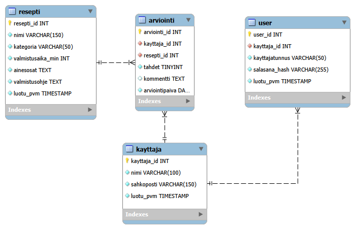

# Reseptiarviointi API

Tämä repositorio sisältää Tietokannat ja rajapinnat -kesäkurssin harjoitustyön. Projektissa on toteutettu REST API Node.js- ja Express-kehyksellä sekä MySQL-tietokannalla.

Sovelluksen aiheena on reseptien arviointi. Sovelluksessa voidaan hallita käyttäjiä, reseptejä ja arviointeja. Taso 2 -vaatimuksen mukaisesti sovellukseen on toteutettu myös JWT-pohjainen bearer token autentikointi.

---

## Teknologiat

| Tekniikka         | Käyttötarkoitus                       |
| ----------------- | ------------------------------------- |
| Node.js + Express | Palvelin ja reititys                  |
| MySQL + mysql2    | Tietokanta ja tietokantayhteydet      |
| bcryptjs          | Salasanojen hajautus                  |
| jsonwebtoken      | JWT-autentikointi                     |
| dotenv            | Ympäristömuuttujat                    |
| Postman           | API:n testaus                         |
| MySQL Workbench   | Tietokannan mallinnus ja ER-diagrammi |

---

## Tietokannan rakenne

Tietokannan nimi on `reseptiarviointi`.

Tietokannassa on neljä taulua:

| Taulu       | Kuvaus                                                                                 |
| ----------- | -------------------------------------------------------------------------------------- |
| `kayttaja`  | Sovelluksen käyttäjät, jotka voivat arvioida reseptejä                                 |
| `resepti`   | Arvioitavat reseptit                                                                   |
| `arviointi` | Yhdistää käyttäjän ja reseptin sekä sisältää tähtimäärän, kommentin ja arviointipäivän |
| `user`      | Kirjautumistiedot, jossa salasana tallennetaan bcrypt-hajautettuna                     |

Taulujen ja sarakkeiden nimet ovat tietokannassa suomeksi ilman ääkkösiä. API-reitit ja JSON-kentät ovat englanniksi.


### ER-diagrammi

ER-diagrammi löytyy kansiosta:

```text
documentation/reseptiarviointi_ER.png
```

Alla myös suoraan kuva tietokannan ER-diagrammista:



---

## Stored proceduret

Tietokantaan on toteutettu kaksi stored procedurea:

| Procedure                 | API-reitti                            |
| ------------------------- | ------------------------------------- |
| `hae_reseptin_arvioinnit` | `GET /api/recipes/:id/reviews`        |
| `hae_reseptin_keskiarvo`  | `GET /api/recipes/:id/average-rating` |

Ensimmäinen procedure hakee reseptin kaikki arvioinnit. Toinen procedure palauttaa reseptin arviointien lukumäärän sekä keskiarvon.

---

## Asennus ja käyttöönotto

### 1. Riippuvuuksien asennus

Asenna projektin riippuvuudet:

```bash
npm install
```

### 2. Ympäristömuuttujat

Kopioi `.env.example`-tiedosto ja täytä omat asetuksesi:

```bash
copy .env.example .env
```

Esimerkki `.env`-tiedoston sisällöstä:

```env
DB_HOST=localhost
DB_PORT=3306
DB_USER=root
DB_PASSWORD=
DB_NAME=reseptiarviointi
PORT=3000
JWT_SECRET=oma_salainen_avain
```

Varsinaista `.env`-tiedostoa ei tallenneta versionhallintaan.

### 3. Tietokannan luonti

Aja SQL-tiedostot MySQL:ssä seuraavassa järjestyksessä:

```text
sql/database.sql
sql/seed.sql
sql/procedures.sql
sql/auth.sql
```

Tiedostojen tarkoitukset:

| Tiedosto         | Tarkoitus                              |
| ---------------- | -------------------------------------- |
| `database.sql`   | Luo tietokannan ja päätaulut           |
| `seed.sql`       | Lisää testidatan                       |
| `procedures.sql` | Luo stored proceduret                  |
| `auth.sql`       | Luo kirjautumista varten `user`-taulun |

### 4. Sovelluksen käynnistys

Käynnistä sovellus kehitystilassa:

```bash
npm run dev
```

Sovellus käynnistyy oletuksena osoitteeseen:

```text
http://localhost:3000
```

---

## API-reitit

### Yleiset tarkistusreitit

```http
GET /api/health
GET /api/database-check
```

### Autentikointi

```http
POST /api/auth/register
POST /api/auth/login
```

### Reseptit

Nämä reitit vaativat JWT-tokenin.

```http
GET    /api/recipes
POST   /api/recipes
PUT    /api/recipes/:id
DELETE /api/recipes/:id
```

### Käyttäjät

Nämä reitit vaativat JWT-tokenin.

```http
GET    /api/users
POST   /api/users
PUT    /api/users/:id
DELETE /api/users/:id
```

### Arvioinnit

Nämä reitit vaativat JWT-tokenin.

```http
GET    /api/reviews
POST   /api/reviews
PUT    /api/reviews/:id
DELETE /api/reviews/:id
```

### Stored procedure -reitit

Nämä reitit vaativat JWT-tokenin.

```http
GET /api/recipes/:id/reviews
GET /api/recipes/:id/average-rating
```

---

## Autentikointi

Sovellus käyttää JWT-pohjaista autentikointia.

Uusi kirjautumiskäyttäjä luodaan reitillä:

```http
POST /api/auth/register
```

Kirjautuminen tehdään reitillä:

```http
POST /api/auth/login
```

Kirjautuminen palauttaa JWT-tokenin. Token lisätään suojattuihin pyyntöihin Postmanissa kohdassa:

```text
Authorization -> Bearer Token
```

Ilman voimassa olevaa tokenia suojatut reitit palauttavat `401 Unauthorized` -vastauksen.

---

## Testaus

API on testattu Postmanilla. Postman-kokoelma löytyy kansiosta:

```text
documentation/reseptiarviointi_postman_collection.json
```

Postman-kokoelmassa on testit seuraaville kokonaisuuksille:

* tarkistuspyynnöt
* autentikointi
* reseptit
* käyttäjät
* arvioinnit
* stored procedure -reitit

---

## Esittelyvideo
Minulla oli vaikeuksia nauhoittaessa mikrofonin toiminnan kanssa, toivottavasti ytimekkäänä pidetty video tietokannan toiminnasta sekä taustamusiikki on tässäkohtaa riittävä.


Linkki esittelyvideoon:
https://unioulu-my.sharepoint.com/:v:/r/personal/ehalonen25_students_oamk_fi/Documents/Videot/Clipchamp/Desktop%202026.08.02%20-%2022.28.18.22/Exports/Desktop%202026.08.02%20-%2022.28.18.22.mp4?d=w82d180e5896840b5a659ebfd3285843c&csf=1&web=1&e=5IKR0q


